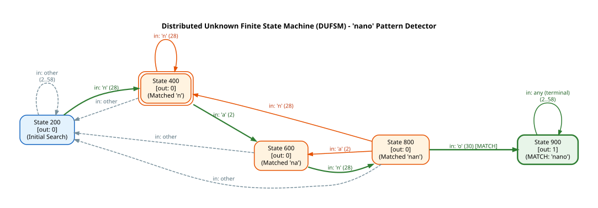

# Blindly Follow: SITS CRT and FHE for DCLSMPC of DUFSM

[](https://github.com/sdoolman/blindly_follows/actions/workflows/ci.yml)
[](https://opensource.org/licenses/MIT)
[](https://www.python.org/downloads/)

**Blindly Follow** is the official reference proof-of-concept implementation for the research paper:

> **"Blindly Follow: SITS CRT and FHE for DCLSMPC of DUFSM"**  
> *Shlomi Dolev and Stav Doolman*  
> *International Symposium on Cyber Security, Cryptography and Machine Learning (CSCML 2021)*  
> Lecture Notes in Computer Science (LNCS), Springer.  
> [Springer Link](https://doi.org/10.1007/978-3-030-78086-9) | [ResearchGate](https://www.researchgate.net/publication/352932314_Blindly_Follow_SITS_CRT_and_FHE_for_DCLSMPC_of_DUFSM)

---

## Theoretical Overview & Purpose

This proof-of-concept demonstrates how to execute a **Distributed Unknown Finite State Machine (DUFSM)** using **Distributed Communication-Less Secure Multi-Party Computation (DCLSMPC)** powered by **Statistical Information Theoretic Security (SITS)** via the **Chinese Remainder Theorem (CRT)** and **Fully Homomorphic Encryption (FHE / BGV)**:

```
                  +----------------------------------------------+
                  |           Global State Machine               |
                  |     Encoded into Modular Polynomial P(x)     |
                  +----------------------------------------------+
                                         |
               +-------------------------+-------------------------+
               | (Projected shares modulo coprime sequence m_i)    |
               v                                                   v
     +-------------------+                               +-------------------+
     | Worker 1 (mod m1) |                               | Worker n (mod mn) |
     |  P1(x) = P(x)%m1  |   ... Communication-less ...  |  Pn(x) = P(x)%mn  |
     | Evaluates Stream  |                               | Evaluates Stream  |
     +-------------------+                               +-------------------+
               |                                                   |
               +-------------------------+-------------------------+
                                         v
                         +-------------------------------+
                         |    Garner's CRT Algorithm     |
                         |  Global State Reconstruction  |
                         +-------------------------------+
```

1. **DUFSM & Polynomial Representation**: A state machine whose states and transitions remain confidential from computing parties is encoded into a modular polynomial $P(x) \pmod M$ via Lagrange interpolation.
2. **SITS CRT & Mignotte Threshold Scheme**: The global modulus $M = \prod_{i=1}^n m_i$ is partitioned into pairwise coprime moduli $(m_1, m_2, \dots, m_n)$ satisfying Mignotte's condition ($\prod_{i=1}^k m_i > \prod_{i=0}^{k-2} m_{n-i}$).
3. **DCLSMPC (Communication-Less Execution)**: Independent distributed worker processes evaluate input symbols blindly over their projected share $P(s + c) \pmod{m_i}$ without exchanging any network messages during evaluation.
4. **Garner Reconstruction**: When requested, outputs from any $k$ out of $n$ parties are combined using Garner's algorithm to reconstruct the true state without revealing intermediate computational paths.
5. **Homomorphic Binary Reduction (BGV / HElib)**: The C++ component demonstrates homomorphic modulo reduction $(a \pmod m)$ over BGV ciphertexts using IBM's [HElib](https://github.com/IBM-HElib/HElib).

---

## State Machine Visualization

The global state machine diagram is generated by running `main.py` using Graphviz (`dot`).



*To regenerate the state machine diagram:*
```bash
python main.py
```

---

## Directory Structure

```
.
├── main.py                   # Main simulation runner (FSM data gen, polynomial interpolation, multiprocessing, Graphviz)
├── pyproject.toml            # PEP 621 Python package configuration & dependencies
├── Pipfile                   # Pipenv environment specification
├── Dockerfile                # Multi-stage Docker container specification
├── docker-compose.yml        # Docker Compose configuration for app & testing
├── README.md                 # Project documentation & paper reference
├── LICENSE                   # MIT License
│
├── blind_operations/         # Cryptographic blind operations & FHE
│   ├── blind_match.py        # Bit-array pattern matching over masked states
│   ├── BGV_binary_modulo_reduction.cpp  # HElib BGV homomorphic binary modulo reduction
│   └── CMakeLists.txt        # C++ build system configuration for HElib
│
├── crt/                      # Chinese Remainder Theorem algorithms
│   ├── generic_functions.py  # Mignotte threshold parameter search & coprime sequence generation
│   ├── error_correct.py      # Error correction routines
│   └── test_data_leakage.py  # Data leakage analysis tests
│
├── polynomials/              # Explicit algebraic operations over modular rings
│   ├── polymod.py            # Mod & PolyMod classes with explicit Euclidean & Lagrange algorithms
│   ├── lagrange.py           # Lagrange interpolation
│   └── shamir.py             # Shamir polynomial evaluation
│
├── secret_sharing/           # Secret sharing utilities & math libraries
│   ├── mathlib.py            # Garner algorithm for CRT reconstruction & primality tests
│   ├── bloom.py              # Asmuth-Bloom threshold scheme
│   └── ab_shares_arithmetic.py
│
└── tests/                    # Unit test suite (pytest)
    ├── test_crt.py
    ├── test_polynomials.py
    └── test_secret_sharing.py
```

---

## Quickstart & Installation

### Option 1: Native Setup (Python 3.10+)

1. **Install System Dependencies** (Graphviz is required for diagram rendering):
   ```bash
   # Ubuntu / Debian
   sudo apt-get install -y graphviz libgmp-dev libmpfr-dev libmpc-dev

   # macOS (Homebrew)
   brew install graphviz gmp mpfr libmpc
   ```

2. **Install Python Package**:
   ```bash
   pip install -e .[dev]
   ```

3. **Run Main Simulation**:
   ```bash
   python main.py
   ```

4. **Run Unit Tests & Linters**:
   ```bash
   pytest
   ruff check .
   ```

---

### Option 2: Containerized Execution (Docker & Docker Compose)

Run the entire application environment isolated inside Docker (includes Graphviz and math libraries out-of-the-box):

- **Run Main Simulation**:
  ```bash
  docker-compose up app
  ```

- **Run Test Suite**:
  ```bash
  docker-compose up test
  ```

---

## C++ BGV Modulo Reduction (HElib)

To compile the C++ BGV homomorphic modulo reduction tool (`blind_operations/BGV_binary_modulo_reduction.cpp`):

```bash
cd blind_operations
mkdir build && cd build
cmake ..
make
./bgv_binary_reduction
```

---

## Citation

If you use or build upon this work, please cite:

```bibtex
@inproceedings{dolev2021blindly,
  title={Blindly Follow: SITS CRT and FHE for DCLSMPC of DUFSM},
  author={Dolev, Shlomi and Doolman, Stav},
  booktitle={International Symposium on Cyber Security, Cryptography and Machine Learning (CSCML 2021)},
  series={Lecture Notes in Computer Science},
  publisher={Springer},
  year={2021}
}
```

---

## License

Distributed under the [MIT License](LICENSE).
